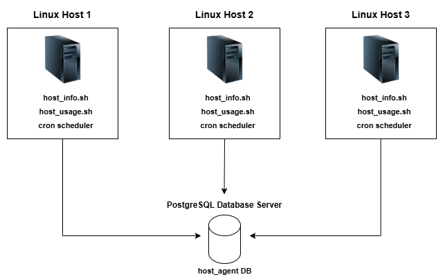

# Linux Cluster Monitoring Agent

## Introduction

The Linux Cluster Monitoring Agent is a comprehensive monitoring solution designed to collect, store, and analyze hardware specifications and real-time resource usage data across multiple Linux servers. This project addresses the critical need for infrastructure teams to maintain visibility into server performance, capacity planning, and resource optimization within distributed computing environments.

The system targets system administrators, DevOps engineers, and infrastructure teams who require continuous monitoring of server clusters to ensure optimal performance and proactive maintenance. Built using industry-standard technologies including Bash scripting for data collection, Docker for containerized PostgreSQL database deployment, and Linux cron for automated scheduling, the solution provides enterprise-grade monitoring capabilities with minimal overhead.

The architecture implements a two-tier data collection model: static hardware profiling performed once per server, and dynamic resource usage tracking executed continuously via automated scheduling. This design ensures comprehensive monitoring while maintaining system efficiency and data integrity through relational database constraints.

## Quick Start

```bash
# Start PostgreSQL instance
./scripts/psql_docker.sh create postgres password

# Create database tables
psql -h localhost -U postgres -f sql/ddl.sql

# Collect hardware specifications (run once per server)
./scripts/host_info.sh localhost 5432 host_agent postgres password

# Collect resource usage data (run manually for testing)
./scripts/host_usage.sh localhost 5432 host_agent postgres password

# Set up automated data collection
crontab -e
# Add: * * * * * /path/to/host_usage.sh localhost 5432 host_agent postgres password
```

## Implementation

### Architecture



The system implements a centralized monitoring architecture where multiple Linux hosts report to a shared PostgreSQL database. Each server runs monitoring agents that collect local system metrics and transmit data to the central repository. This design enables cluster-wide visibility while maintaining data consistency and supporting horizontal scaling as infrastructure grows.

### Scripts

**psql_docker.sh**
Manages PostgreSQL container lifecycle with automated Docker service management and container status validation.

```bash
# Create new PostgreSQL container
./scripts/psql_docker.sh create postgres password

# Start existing container
./scripts/psql_docker.sh start

# Stop running container
./scripts/psql_docker.sh stop
```

**host_info.sh**
Performs one-time collection of static hardware specifications including CPU architecture, memory capacity, and system configuration. Executed once per server during initial setup.

```bash
./scripts/host_info.sh psql_host psql_port db_name psql_user psql_password
```

**host_usage.sh**
Collects real-time resource utilization metrics including CPU usage, memory consumption, disk I/O, and available storage. Designed for continuous execution via cron scheduling.

```bash
./scripts/host_usage.sh psql_host psql_port db_name psql_user psql_password
```

**crontab**
Automated scheduling system that executes host_usage.sh every minute to ensure continuous data collection and real-time monitoring capabilities.

```bash
* * * * * /path/to/host_usage.sh localhost 5432 host_agent postgres password
```

**queries.sql**
Business intelligence queries addressing critical infrastructure management challenges including server performance analysis, resource utilization trending, and capacity planning optimization. Resolves operational problems such as identifying underperforming servers, detecting resource bottlenecks, and supporting data-driven scaling decisions.

### Database Modeling

**host_info**

| Column           | Data Type | Description                          |
| ---------------- | --------- | ------------------------------------ |
| id               | SERIAL    | Auto-generated primary key           |
| hostname         | VARCHAR   | Fully qualified domain name          |
| cpu_number       | INT2      | Number of CPU cores                  |
| cpu_architecture | VARCHAR   | CPU architecture (x86_64, ARM, etc.) |
| cpu_model        | VARCHAR   | Detailed CPU model information       |
| cpu_mhz          | FLOAT8    | CPU frequency in MHz                 |
| l2_cache         | INT4      | L2 cache size in KB                  |
| timestamp        | TIMESTAMP | Hardware collection timestamp        |
| total_mem        | INT4      | Total system memory in KB            |

**host_usage**

| Column         | Data Type | Description                        |
| -------------- | --------- | ---------------------------------- |
| timestamp      | TIMESTAMP | Data collection timestamp          |
| host_id        | INT4      | Foreign key reference to host_info |
| memory_free    | INT4      | Available memory in MB             |
| cpu_idle       | INT2      | CPU idle percentage                |
| cpu_kernel     | INT2      | CPU kernel usage percentage        |
| disk_io        | INT4      | Current disk I/O operations        |
| disk_available | INT4      | Available disk space in MB         |

## Test

The bash scripts and DDL were tested through systematic validation across multiple scenarios. Database schema creation was verified by executing the DDL script and confirming table creation with proper constraints and relationships. Script functionality was tested by manually executing both host_info.sh and host_usage.sh with various parameter combinations to ensure proper error handling and data insertion.

Testing results demonstrated successful data collection with proper foreign key relationships between host_info and host_usage tables. The scripts correctly handled edge cases including missing parameters, database connection failures, and duplicate hostname scenarios. Cron automation was validated by monitoring continuous data insertion over extended periods, confirming reliable minute-by-minute data collection without memory leaks or performance degradation.

## Deployment

The application deployment leverages multiple technologies for comprehensive infrastructure management. GitHub serves as the version control and collaboration platform, enabling team development and change tracking across the monitoring solution. Docker containerization provides consistent PostgreSQL database deployment across different environments, ensuring reliable data persistence through volume mounting.

Crontab integration enables automated, system-level scheduling that survives server reboots and provides enterprise-grade reliability for continuous monitoring. The deployment architecture supports both single-server and multi-server configurations, with the same scripts scaling seamlessly from development environments to production clusters containing hundreds of nodes.

## Improvements

**Handle Hardware Updates**
Implement detection and automatic updating of hardware specifications when physical changes occur, such as memory upgrades or CPU replacements, rather than requiring manual re-execution of host_info.sh.

**Implement Alert System**
Develop threshold-based alerting mechanisms that automatically notify administrators when resource utilization exceeds predefined limits, enabling proactive response to performance issues before they impact system availability.

**Add Data Retention Policies**
Create automated data lifecycle management to archive or purge historical usage data based on configurable retention periods, preventing database growth from affecting performance while maintaining relevant historical trending capabilities.

